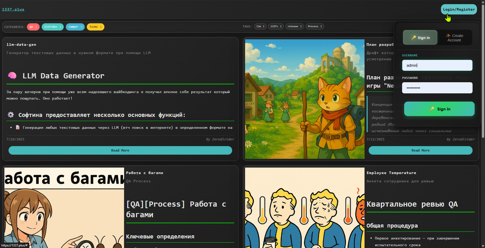

# ts-cms

A simple, TypeScript-based Content Management System (CMS) built with Node.js, Express.js, and SQLite. Content in markdown.

# IDEA

I made this project as an alternative to the big, complex CMS systems which I am too tired to use. I wanted something simple, lightweight, and easy to set up, while still providing essential CMS features like user management, content creation, and a clean frontend.

Also this project is part of my learning journey with TypeScript, Node.js, and Express.js, so it serves as a practical example of how to build a RESTful API and a simple frontend.

LLM was used, but not extensively. The code is mostly written by me, with some help from LLM for specific tasks like generating SQL queries and basic CRUD operations. I'll continue to improve the codebase quality to refactor and simplify code where possible.

New features will be added as needed, but the focus will remain on keeping the system lightweight and easy to use.
__Feel free to open issues or pull requests if you have suggestions or improvements!__

## Features

-   **User Authentication**: "Secure" user registration, login, and profile management. At least JWT and salted.
-   **Role-Based Access Control**: Differentiate user permissions, including an admin role for privileged operations.
-   **Markdown-based Records**: Create, read, update, and delete (CRUD) content records stored as Markdown.
-   **Content Publishing**: Records can be marked as published or unpublished, controlling their visibility on the frontend, only admins can see unpublished by API.
-   **Admin Panel**: A dedicated interface for group 'admin' to manage users and all content records (published and unpublished).
-   **Dynamic Frontpage**: Displays published records with author information and excerpts, adapting its layout based on the number of records.
-   **Single Record View**: Dedicated pages for viewing full record content with Markdown rendering.
-   **SQLite Database**: Lightweight and file-based database. We dont need that much data.
-   **Frontend**: Built with plain JavaScript and Bootstrap for keeping at simple and controllable for anyone. 

## Prerequisites

Before you begin, ensure you have the following installed on your system:

-   [Node.js](https://nodejs.org/en/) (LTS version recommended)
-   [npm](https://www.npmjs.com/) (comes with Node.js)

## Installation

Follow these steps to get the project up and running on your local machine:

1.  **Clone the repository**:

    ```bash
    git clone https://github.com/diviatrix/ts-cms.git
    cd ts-cms
    ```

2.  **Install dependencies**:

    ```bash
    npm install
    ```

## Usage

To start the CMS server:

```bash
npm start
```

The server will typically run on `http://localhost:7331` (check your console for the exact address and port).

### Important Considerations

-   **Database Schema Management**: Database tables are automatically created and checked on application launch based on the schemas defined in `src/db-adapter/sql-schemas.ts`. However, there is currently no automated migration mechanism. If you modify existing table fields in the code, you might need to manually adjust your `database.db` or delete it to recreate tables on next launch.
-   **Admin Role Validation**: The `admin` role is crucial for accessing privileged sections (like the admin panel and certain API endpoints). This role validation is strictly enforced on the backend.
-   **Non-Authorized Access**: While admin-specific features are protected, certain API endpoints (e.g., fetching published records) are accessible without authentication, allowing non-authorized (anonymous) users to view public content.

### Accessing the CMS

-   **Frontpage**: Open your web browser and navigate to `http://localhost:7331`.
    -   You will see all published records. Unpublished records are not visible to anonymous users.
-   **Admin Panel**: Navigate to `http://localhost:7331/admin`.
    -   To access the admin panel, you need to log in with a user that has the `admin` role.
    -   **Setting up an Admin User**:
        1.  Register a new user through the login/register page (`http://localhost:7331/login`).
        2.  Access the database directly (e.g., using a SQLite browser) and modify the `user_profiles` table for your registered user. Set the `roles` column to `["user", "admin"]` (as a JSON string).
        3.  Alternatively, if you have an existing admin user, you can log in with them and use the admin panel's user management section to assign the `admin` role to other users.
    -   From the admin panel, you can manage users and records. Only published records are visible on the frontpage and public record pages.

### Database

The CMS uses SQLite, and the database file (`database.db`) will be created in the `data/` directory in the project root upon first startup if it doesn't already exist. Dummy user and record data are automatically inserted during the initial database setup.

## Project Structure

The frontend of this CMS is located within the `public/` directory. These static assets (HTML, CSS, JavaScript, images) are served directly by the Express.js backend.

```
. (project root)
├── public/             # Frontend static files (HTML, CSS, JS)
│   ├── admin/          # Admin panel pages and scripts
│   ├── frontpage/      # Frontpage scripts
│   ├── js/             # General frontend JavaScript utilities
│   ├── nav/            # Navigation bar components
│   └── record/         # Single record view page
├── src/                # Backend TypeScript source code
│   ├── data/           # Configuration and static data
│   ├── db-adapter/     # Database adapter and SQL schemas
│   ├── functions/      # Backend business logic functions
│   ├── types/          # TypeScript interfaces and types
│   └── utils/          # Utility functions (JWT, password hashing)
├── server.ts           # Main server entry point
├── tsconfig.json       # TypeScript configuration
├── package.json        # Project dependencies and scripts
```

## Important Modules

This project leverages several key Node.js modules to provide its functionality:

-   **Express.js**: The web framework used to build the RESTful API and serve static frontend files.
-   **SQLite3**: The database driver for interacting with the SQLite database.
-   **bcrypt**: Used for hashing and salting user passwords to ensure secure authentication.
-   **jsonwebtoken**: For implementing JSON Web Tokens (JWTs) to handle user sessions and authentication.
-   **uuid**: Generates unique identifiers (UUIDs) for records and other entities.
-   **marked**: A Markdown parser used on the frontend to render record content.


## Contributing

Contributions are welcome! Please feel free to submit a Pull Request.

## Future Plans

Key areas for future development and necessary improvements include:

1.  **Security Hole Fix: Role Assignment**: Currently, users can self-assign roles in profile settings, **thats why you should not use this in production yet!**
    -   I need to move user-group assignments to a dedicated `user_groups` table (`user_id`, `[group_id, group_id, ... ]`) and rework a bit of logic.
    -   Optional: Implement permission scheme where groups are assigned specific permissions (e.g., `records.all`, `users.read.profile`). For example, an `admin` group would have `*` (full access), while an `editor` group could have `records.*` (full record management) and `users.read.profile` (read-only access to user profiles, excluding sensitive data). I just like how it work in Minecraft. 
    - And probably it will help to simplify functions to check permissions, like `hasPermission(user, 'records.all')` and not groups, like it is now. Also, now some api return different data based on user group, like `getRecordsByAuthorId` returns all records for admin, but only published for other users. This could be simplified with permissions.
2.  **Customization**: Develop simple theming system for the frontpage. 
    -   Colors, google fonts, favicon, logo, footer, and menu links configurable, should be enough for start.
    -   Will try to make it as theme to be easily customizable with your own CSS and HTML.
3.  **File Manager**: 
    -   To avoid going directly to server every time you simply need to add pic to records, I want to make a simple file manager for upload/delete files.
4.  **Comments**: 
    -   Thinking about a basic integrated system (what to use for anti-spam?) or provide fields for setting up third-parties like Disqus.

## License

Basically, you can do whatever you want with it, but don't sell as yours, and if you are grateful enough - please keep the original license and credit me if you use this code in your projects.

This project is licensed under [this](LICENSE).
