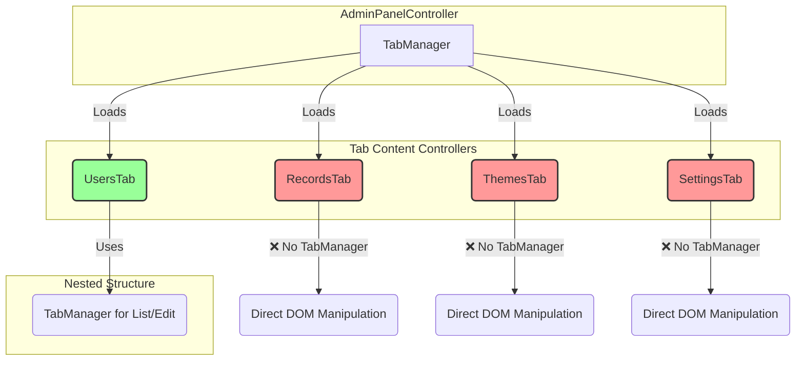
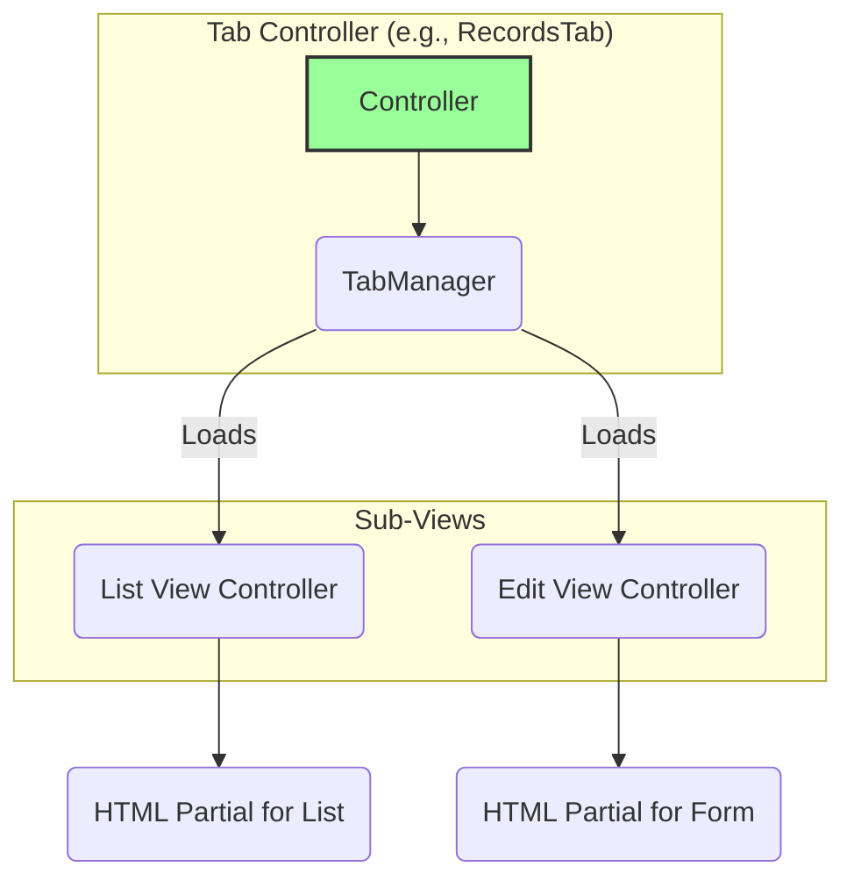

# Admin Panel Refactoring Plan

## 1. Analysis of the Problem

Based on the code review, the root cause of the issues on the admin page is an inconsistent implementation of the tab content controllers.

*   **Correct High-Level Implementation:** The main controller, `admin-panel-controller.js`, correctly uses the `TabManager` component to manage the primary navigation between "Users", "Records", "Themes", and "Settings".
*   **Inconsistent Content Implementation:** The controllers for these tabs do not follow a unified structure.
    *   `UsersTab` correctly implements a nested `TabManager` to handle its own "List" and "Edit" views, demonstrating the intended component-based architecture.
    *   `SettingsTab`, `RecordsTab`, and `ThemesTab` appear to use an older, monolithic approach. They load a single large HTML partial and manipulate the DOM directly. This lack of encapsulation causes their logic and UI to "bleed" across tabs, resulting in the bug where only the settings content is visible.

The current architecture can be visualized as follows:

## 2. Proposed Solution: Standardize All Tabs

The solution is to refactor `RecordsTab`, `ThemesTab`, and `SettingsTab` to follow the same robust, component-based pattern as `UsersTab`.

Each tab controller will:
1.  Be responsible for its own content area.
2.  Use a nested `TabManager` to manage its internal states (e.g., a "List" view and an "Edit/Create" view).
3.  Load smaller, more focused HTML partials for each sub-tab, rather than one large partial.

This will enforce proper encapsulation, eliminate UI conflicts, and make the codebase significantly easier to maintain and extend.

The target architecture for **every** tab controller will be:

## 3. Refactoring Steps

### Step 1: Refactor `records-tab.js` (Complete)

1.  **Create Sub-Partials:** Split the monolithic `public/partials/records-tab.html` into smaller, focused files:
    *   `public/partials/records/list.html`: For displaying the list of records.
    *   `public/partials/records/edit.html`: For the record creation/editing form.
2.  **Update `RecordsTab` Controller:**
    *   Modify `records-tab.js` to initialize a `TabManager` for "List" and "Edit" sub-tabs.
    *   The "List" tab's loader will fetch and render the records into the `list.html` partial.
    *   The "Edit" tab will be hidden by default and shown only when a user clicks "Edit" or "Create New".
    *   All DOM manipulation and event handling will be scoped to the appropriate sub-view.

### Step 2: Refactor `themes-tab.js` (Complete)

1.  **Create Sub-Partials:** Split `public/partials/themes-tab.html`:
    *   `public/partials/themes/list.html`: For the grid of available themes.
    *   `public/partials/themes/edit.html`: For the theme editor/creation form.
2.  **Update `ThemesTab` Controller:**
    *   Modify `themes-tab.js` to use a `TabManager` for "Available Themes" and "Edit Theme" sub-tabs.
    *   The "Edit Theme" view will load the selected theme's data into the form.

### Step 3: Refactor `settings-tab.js`

1.  **Create Sub-Partials:** The settings tab is more complex. We will break it down by category.
    *   `public/partials/settings/general.html`: For site name, description, etc.
    *   `public/partials/settings/users.html`: For registration settings, default roles.
    *   `public/partials/settings/system.html`: For maintenance mode, etc.
2.  **Update `SettingsTab` Controller:**
    *   Modify `settings-tab.js` to use a `TabManager` with tabs for "General", "Users", and "System".
    *   Each loader will populate the corresponding partial with data from the API.
    *   The "Save" button will be moved outside the tabs to save all settings at once, or each tab will have its own save button. This is a design decision to be confirmed.

## 4. Expected Outcome

*   **Bug Fix:** The issue of content bleeding between tabs will be eliminated.
*   **Consistency:** All admin panel code will follow a single, predictable architectural pattern.
*   **Maintainability:** Encapsulated, single-responsibility components are easier to debug, modify, and test.
*   **Scalability:** Adding new admin sections or new sub-tabs will be straightforward.

This plan provides a clear path to a more stable and professional frontend architecture for the admin panel.