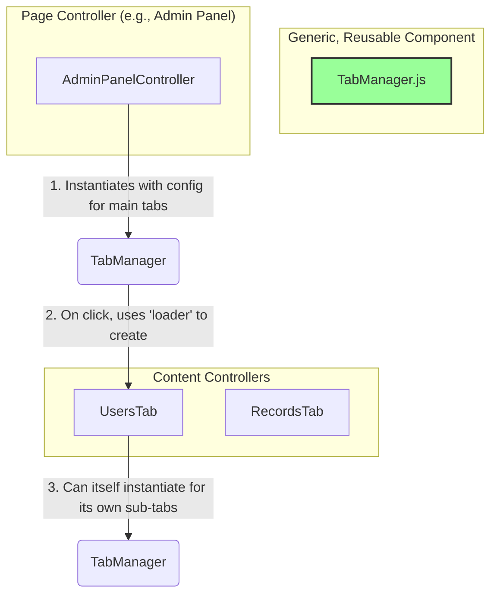

# Frontend Refactor Summary

## 1. Overview

This document summarizes the initial refactoring session for the CMS frontend. The primary goal was to address the broken state of the application after a major backend refactor by implementing a more robust and modern frontend architecture.

## 2. Current Status

The refactoring process is underway. The following has been completed:

*   **Phase 1: Core Cleanup and Consolidation (Complete)**
    *   **API Client**: Consolidated all API logic into a single, robust `public/js/core/api-client.js`.
    *   **Central App Controller**: Created `public/js/core/app.js` as the single entry point for the application.
    *   **Router**: Implemented `public/js/core/router.js` to handle loading page-specific controllers.

*   **Phase 2: Page-by-Page Refactoring (Complete)**
    *   All major pages (`Front Page`, `Profile Page`, `Admin Page`, etc.) have been refactored to work with the new architecture.

## 3. New Architecture: Component-Based Tabs

Following a detailed architectural discussion, we have implemented a new, highly modular, component-based approach for handling tabbed interfaces.

The core of this new architecture is a generic, reusable `TabManager` component.

*   **Decoupling**: The `TabManager` component is completely decoupled from the content it displays. Its sole responsibility is to manage the UI of switching between tabs.
*   **Configuration-Driven**: Any page or component can create a tabbed interface by instantiating `TabManager` with a configuration object. This object specifies which tabs to create and what "loader" function to call to render the content for each tab.
*   **Lazy Loading**: Content for a tab is only loaded the first time the user clicks on it, ensuring optimal performance.
*   **Reusability & Nesting**: Because it's a generic component, the `TabManager` can be reused anywhere. A content controller loaded by a main `TabManager` can, in turn, create its own `TabManager` instance to handle its own internal sub-tabs (e.g., for a list/edit view).

This is illustrated by the following diagram:

## 4. Key Files and Roles

This section outlines the key files in the new component-based architecture.

*   **Core Architecture Files:**
    *   [`public/js/core/app.js`](public/js/core/app.js): The main application entry point.
    *   [`public/js/core/router.js`](public/js/core/router.js): Maps URLs to page controllers.
    *   [`public/js/core/api-client.js`](public/js/core/api-client.js): Unified API client.

*   **Generic Component:**
    *   [`public/js/components/tab-manager.js`](public/js/components/tab-manager.js): The new, reusable component for creating and managing any tabbed interface.

*   **Refactored Page & Content Controllers:**
    *   [`public/js/controllers/pages/admin-panel-controller.js`](public/js/controllers/pages/admin-panel-controller.js): Orchestrates the admin page. It is now responsible for creating the main `TabManager` instance.
    *   [`public/js/controllers/tabs/users-tab.js`](public/js/controllers/tabs/users-tab.js): **Content Controller**. Manages the logic for the user administration panel. It now uses a nested `TabManager` for its own sub-navigation.
    *   [`public/js/controllers/tabs/records-tab.js`](public/js/controllers/tabs/records-tab.js): **Content Controller**. Manages the logic for the records panel, also using a nested `TabManager`.

## 5. Project Status

*   **Phase 1 & 2**: Complete.
*   **Phase 3: Component and Module Improvements (Complete)**
    *   The `TabManager` component has been implemented.
    *   The `AdminPanelController` has been refactored to use the `TabManager`.
    *   All primary content tabs (`UsersTab`, `RecordsTab`, `ThemesTab`, `SettingsTab`) have been refactored into the new component-based system.

The frontend refactoring of the tab system is now complete.